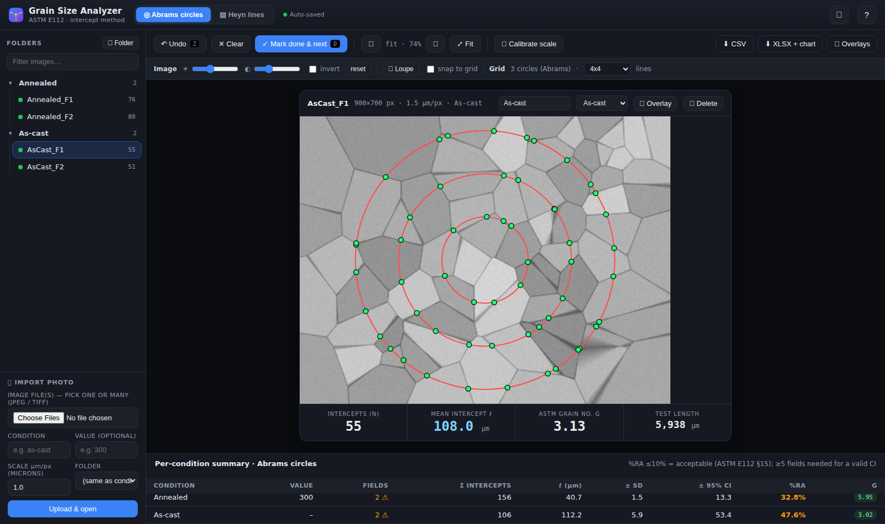
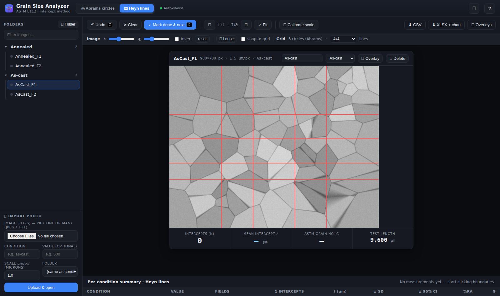
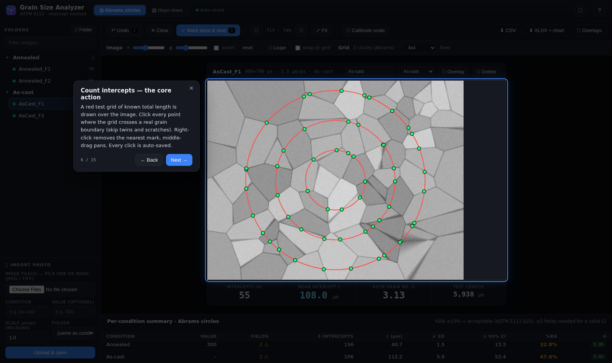
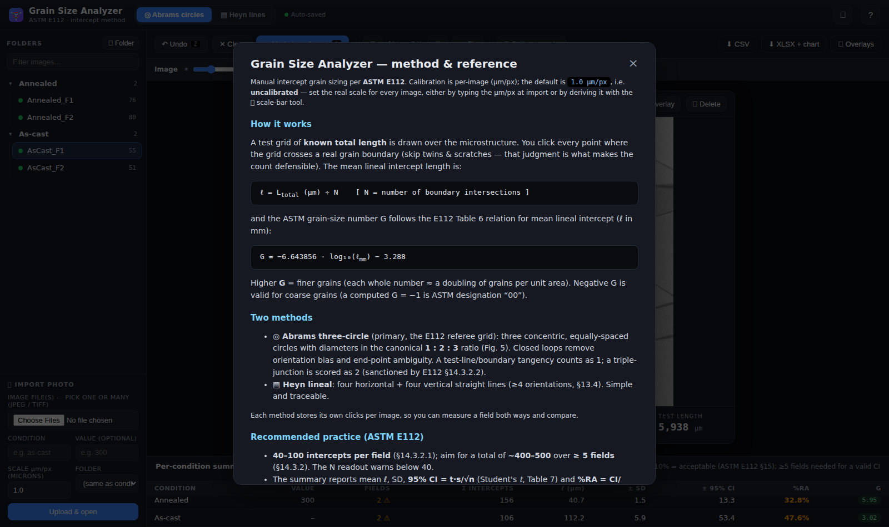
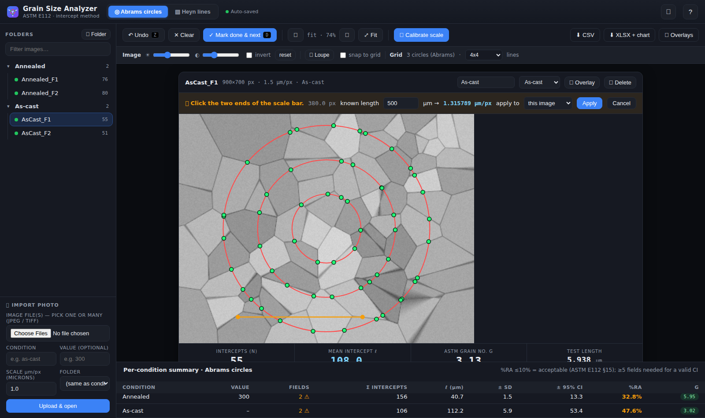

<p align="center"></p>

# Grain Size Analyzer

A self-hosted web tool for **manual grain-size measurement** of metallographic
micrographs by the intercept method, following **ASTM E112-13**. It works with
any etched microstructure — steel, aluminium, magnesium, titanium, copper,
anything with resolvable grain boundaries — on any machine that can run Python.

You click each grain-boundary crossing on a calibrated test grid; the app computes
the **mean lineal intercept length (ℓ)** and the **ASTM grain-size number (G)**,
and aggregates results per condition with proper (Student's-t) confidence
intervals. Everything is stored locally in a single DuckDB file.

**▶ Try the live browser demo (no install):**
https://nikolaisydorenko.github.io/grain-size-analyzer/ — the full GUI with
sample micrographs and a first-run guided tour. Self-hosting this repo additionally
unlocks the XLSX export with a native chart, batch overlay ZIPs, and the
DuckDB/SQL database.



---

## Why manual?

Automated thresholding/segmentation fails on real etched surfaces: **scratches,
annealing twins, and uneven etch all look like grain boundaries** to an algorithm
and cause massive over-counting. A trained eye distinguishes a true boundary from a
twin or scratch and simply doesn't click it — which is exactly what makes an
intercept count defensible in a report or thesis. This tool keeps the human in the
loop while automating the geometry, arithmetic, statistics, and bookkeeping.

---

## Features

- **Condition + Value grouping** — every image carries a free-text **Condition**
  label (an alloy, a heat treatment, a batch, a sample ID — whatever groups your
  study) and an optional numeric **Value** (temperature, composition, time, …).
  The summary is aggregated per condition; when values are present they order the
  table and become the X-axis of the exported chart.
- **Two ASTM E112 intercept methods, switchable via tabs**
  - **Abrams three-circle** (primary, the E112 referee grid) — canonical 1 : 2 : 3
    circles; orientation-averaged, no end-point bias.
  - **Heyn lineal** — straight-line arrays with **adjustable density**
    (3×3 / 4×4 / 5×5, plus diagonal presets for non-equiaxed structures).
  - Each method stores its own clicks per image, so a field can be measured both
    ways and compared.
- **Live readout** — intercept count *N*, mean intercept ℓ (µm), ASTM *G*, and
  total test length, recomputed on every click. *N* turns amber below the
  ASTM-recommended 40 intercepts/field.
- **Per-image calibration** — µm/px stored per image, so mixed magnifications and
  instruments coexist in one project. The default is `1.0 µm/px` (uncalibrated) —
  **set the real scale** at import or with the calibration tool.
- **📏 Scale-bar calibration tool** — click the two ends of a burned-in scale bar,
  enter its known length, and the µm/px is set automatically (apply to this image,
  the whole condition, or all images); existing ℓ/G recompute exactly.
- **Folder tree** — organize images into collapsible, nested, user-named folders
  (create / rename / delete / drag-and-drop); **multi-select** (Ctrl/Shift-click)
  for batch move/delete. Folders are organizational only — the condition drives
  the statistics.
- **Import** — multi-file JPEG/TIFF upload (auto-converted via Pillow); RAW files
  are rejected with a clear "export a JPEG/TIFF" message.
- **Counting ergonomics** — brightness / contrast / **invert** sliders, a
  **magnifier loupe**, **snap-to-grid**, **right-click to remove a mark**,
  **middle-mouse pan**, fit-to-window zoom, and keyboard shortcuts.
- **ASTM-E112-correct statistics** — per condition: mean ℓ̄, sample SD,
  **95 % CI = t·s/√n** (Student's t, Table 7), **%RA** (target ≤ 10 %, §15.6), and
  **G computed from the mean ℓ̄** (never by averaging G, §18.7); < 5 fields flagged.
- **Persistence** — every click auto-saves to a local **DuckDB** file; close the
  tab and resume any time.
- **Exports** — per-image **CSV**, an **XLSX** workbook with a native grain-size
  chart (95 % CI error bars), and annotated **overlay PNGs** (grid + your marks),
  per image or as a zip.
- **Built-in method reference** (the `?` button) with formulas and ASTM citations.

---

## Interface

| | |
|:---:|:---:|
|  |  |
| **Heyn lineal grid** — selectable line density | **Guided tour** — first launch walks through every tool (replay with 🎓) |
|  |  |
| **Method reference** — formulas & ASTM citations behind the `?` button | **📏 Scale-bar calibration** — click the bar's ends, enter its length, µm/px is set |

---

## Measurement methodology (ASTM E112)

### Mean lineal intercept

A test line of known total length `L_total` is laid over the structure and the
number of grain-boundary intersections `N` is counted. The mean lineal intercept
length is

```
ℓ = L_total (µm) / N
```

This is the average distance between boundaries along a random line — a direct,
unbiased measure of grain size. Larger grains → fewer crossings → larger ℓ.

### ASTM grain-size number

ASTM E112 expresses grain size as a dimensionless number `G` (higher = finer; each
whole number is ≈ a doubling of grains per unit area). From the mean lineal
intercept in **millimetres**:

```
G = −6.643856 · log10(ℓ_mm) − 3.288
```

### Why circles (Abrams)

Straight lines suffer two biases: **orientation** (elongated grains read differently
along vs. across) and **end-points** (a line stops mid-grain at the image edge). A
circle is a closed loop pointing in every direction at once, so it averages
orientation automatically and has no end-points. Three concentric circles supply
enough length to reach the **40–100 intercepts per field** ASTM recommends and
sample the field at three radii.

### Calibration

Calibration is **µm per pixel**, from your microscope's objective calibration or
derived in-app from a burned-in scale bar with the 📏 tool. It is stored per image,
so one project can hold images from different magnifications or instruments.
**The shipped default of `1.0 µm/px` is a placeholder — calibrate before trusting
any ℓ value.** (G shifts by the log of any scale error, so this matters.)

---

## Install

Works on **Windows, macOS, and Linux**. You need either **Python 3.11+** or
**Docker** — nothing else.

### Windows

1. Install Python from [python.org/downloads](https://www.python.org/downloads/)
   — during setup, tick **"Add python.exe to PATH"**.
2. Get the code: `git clone https://github.com/nikolaisydorenko/grain-size-analyzer`
   — or click **Code → Download ZIP** on GitHub and extract it (no git needed).
3. Double-click **`run.bat`** in the extracted folder.

The first run creates a private virtual environment and installs the
dependencies automatically; then your browser opens at
`http://localhost:5066`. Every later run starts instantly. To use another
port: `set PORT=8080` in the terminal before running it.

### macOS / Linux

```bash
git clone https://github.com/nikolaisydorenko/grain-size-analyzer
cd grain-size-analyzer
./run.sh
# open http://localhost:5066
```

`run.sh` self-installs on first use (creates `.venv`, installs dependencies)
and just starts the app afterwards. `./install.sh` runs the install step alone.
On a fresh Mac, running `python3` once triggers the Command Line Tools install
if needed (or `brew install python`).

Make targets are available too: `make install`, `make run`, `make docker`.

### Docker (any platform)

```bash
git clone https://github.com/nikolaisydorenko/grain-size-analyzer
cd grain-size-analyzer
docker compose up
# open http://localhost:5066
```

Data (the DuckDB results store, image cache, and exports) persists in
`./data`, `./cache`, and `./out` next to the compose file.

### Manual (any platform, no scripts)

```bash
pip install -r requirements.txt
python app.py            # python3 on macOS/Linux
# open http://localhost:5066
```

The port defaults to **5066**; override it with the `PORT` environment variable
(e.g. `PORT=8080 python3 app.py`, or `set PORT=8080` on Windows). The DuckDB
path can be overridden with `GRAINSIZE_DB`.

---

## Quick start

Start the app and add images with the **＋ Import photo** panel (bottom-left):
pick the files, type a **Condition** label, optionally a numeric **Value**, and
the scale in µm/px (or calibrate afterwards with the 📏 tool).

To bulk-load a folder of images from the command line instead:

```bash
python3 scripts/prepare_cache.py /path/to/images --condition as-cast --umpp 0.53
python3 scripts/prepare_cache.py /path/to/more --condition annealed-300C --value 300 --append
```

See `scripts/prepare_cache.py --help`.

---

## Usage

See **[docs/USER_GUIDE.md](docs/USER_GUIDE.md)** for the full measuring workflow.
In short:

1. Pick an image in the left list.
2. Choose a method tab (**Abrams circles** or **Heyn lines**).
3. Click every point where the grid crosses a **real** grain boundary. Skip twins
   and scratches. Use **Undo** (`Z`) to fix mistakes; zoom for precision.
4. Watch the live ℓ / G. Aim for 40–100 intercepts; do ≥ 5 fields per condition.
5. **Mark done & next** (`D`) to advance.
6. Export **CSV**, **XLSX + chart**, or **overlays** when finished.

**Keyboard:** `Z` undo · `D` done & next · `←/→` prev/next image · `1/2` method.

### Data

The local store is `grainsize.duckdb` (table `intercepts`, primary key
`(name, method)`). The CSV export schema:

```
condition, value, image, method, n_intercepts, umpp, test_len_um, l_um, ASTM_G, done
```

---

## Deployment

Any way you can run a Flask app works. See **[docs/DEPLOYMENT.md](docs/DEPLOYMENT.md)**
for a systemd unit example and the Docker option.

---

## Project structure

```
app.py                     Flask app — UI + API + DuckDB store, single file
requirements.txt
install.sh / run.sh        Install & run scripts (macOS / Linux)
run.bat                    Double-click launcher (Windows)
Makefile                   make install / run / docker
Dockerfile, docker-compose.yml
scripts/prepare_cache.py   Bulk-load cache/ + index.json from a folder of images
cache/                     Display JPEGs + index.json   (images gitignored)
out/                       Scratch/export folder        (gitignored)
grainsize.duckdb           Local results store          (gitignored)
docs/USER_GUIDE.md         Measuring workflow & tips
docs/METHODS.md            ASTM E112 method notes & formulas
docs/DEPLOYMENT.md         systemd / Docker deployment
docs/ASTM_E112.md          ASTM E112 reference
docs/index.html            Live browser demo (served via GitHub Pages)
```

---

## References

1. **ASTM E112-13**, *Standard Test Methods for Determining Average Grain Size*, ASTM International, West Conshohocken, PA. See also the [ASTM E112 reference](docs/ASTM_E112.md) in this repo.
2. H. Abrams, “Practical Applications of the Three-Circle Intercept Grain Size Method,” *Metallography* / *Metallurgical Transactions*, 1971.
3. **ASTM E1382**, *Standard Test Methods for Determining Average Grain Size Using Semiautomatic and Automatic Image Analysis*.
4. G. F. Vander Voort, *Metallography: Principles and Practice*, ASM International.

---

## License

MIT — see [LICENSE](LICENSE).
